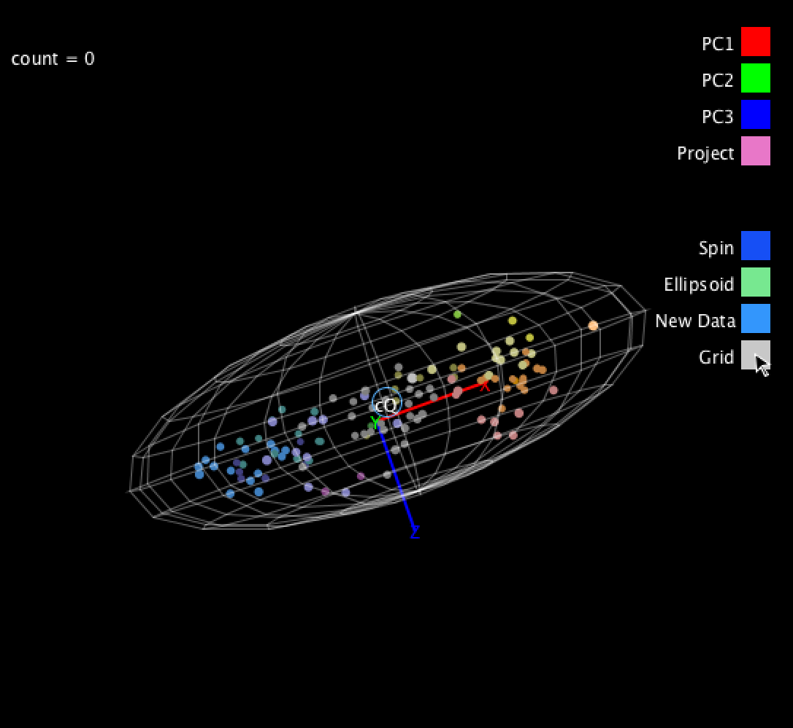
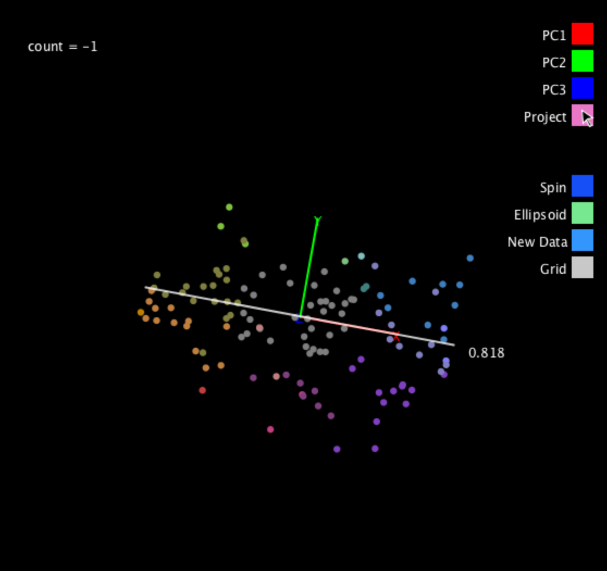

## Synopsis

This program aims to provide an intuitive visual explanation of **Principal Component Analysis** or **PCA**.

Principal Component Analysis is generally used to **reduce the dimension** of a dataset. In a sense, it is a 'compression' of the data. 

If our data is 3D data- for example spatial data -then we can explore a PCA visually. This is because reducing the dimension of 3D data is equivalent to 'flattening it'.

One way of 'flattening' data is simply to ignore or discard one dimension of the data. PCA, however, tells us a way to orientate our data such that we can discard a dimension of the data without losing too much information. The best way to understand this idea is to run this program yourself.

https://vimeo.com/156145588

## Motivation

* To explore visual communication of technical ideas in maths and data science
* To create a solid Matrix.class for future computer graphics and data analysis projects
* To learn and explore Linear Algebra 

## Installation

Download and install Processing from http://www.processing.org.

## Tests

Describe and show how to run the tests with code examples.

## References

Eric Lengyel, Mathematics for 3D Game Programming and Computer Graphics

Mark Richardson, Principal Component Analysis

